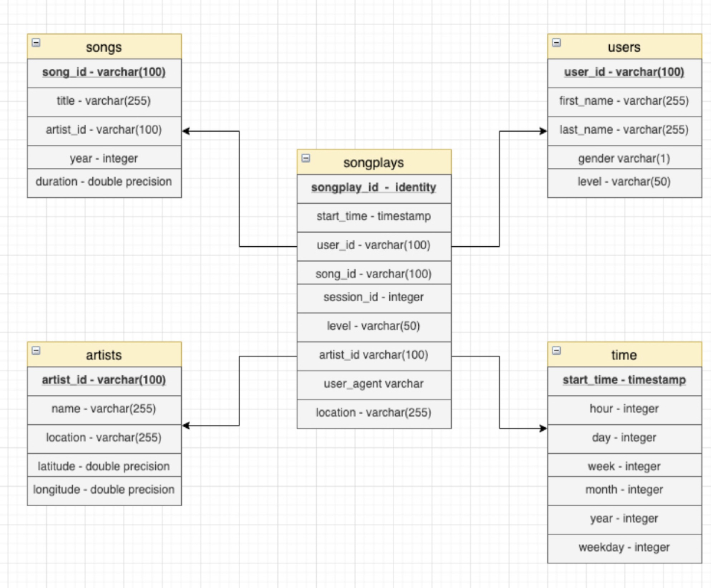

### PROJECT 4: The Data Lake & Apache Spark
--------------------------------------------
## Intro
A music streaming startup, Sparkify, has grown their user base and song database even more and want to move their data warehouse to a data lake. Their data resides in S3, in a directory of JSON logs on user activity on the app, as well as a directory with JSON metadata on the songs in their app.

## The Dataset
I used a datasets provided in two public S3 buckets. The first one buckets contains inforamtion about songs & artists, the second buckets has infortmation about users e.g users which songs are listening, etc. The objects contained in both buckets are JSON files.

--------------------------------------------
#### Schema definition
##### This is the schema of the database 

Following tables. 
### Fact Table
- songplays - records in event data associated with song plays

### Dimension Tables
- artists - artists in music db: artist_id, name, location, lattitude, longitude
- time - timestamps of records in songplays broken down into specific units: start_time, hour, day, week, month, year, weekday
- users - users of application: user_id, first_name, last_name, gender, level
- songs - songs in music db: song_id, title, artist_id, year, duration

--------------------------------------------
#### ETL Pipeline
- I   : I loaded the credentials from dl.cfg.
- II  : Lead the Data which are in JSON files 'song_data' & 'log_data'.
- III : Then loading the JSON files form S3 by use SPARK process these JSONs & generate a set of fact and dimension tables.
- IV  : Load back these fact & dimension tables. 

--------------------------------------------
#### Project Structure
- dl.cfg -> The config file for AWS credentials
- etl.py -> The ETL for read from S3 and then processes data using SPARK and then writes them to a new S3.

